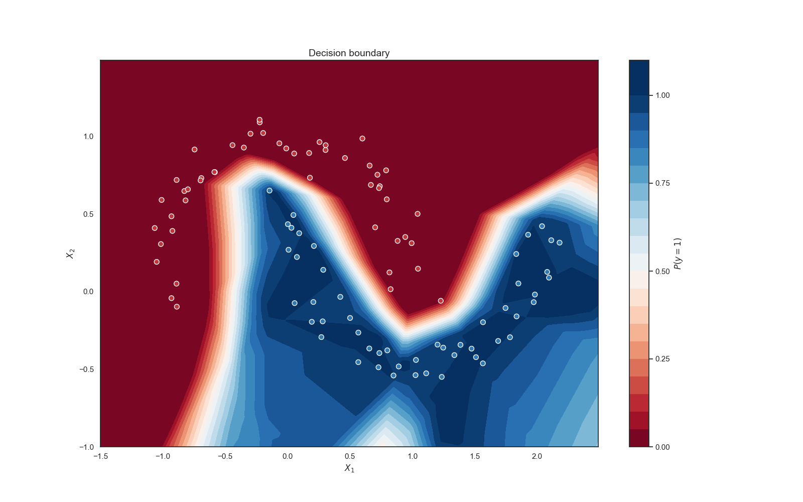

# Machine Learning Model Library

This project is a powerful and fast C++ library for creating machine learning models with CUDA support. It is designed to simplify the process of building and training neural networks for various tasks. Below are the key features and information about this library:

## Key Features

- **Machine Learning Model Creation:** The library allows you to easily create machine learning models for various tasks such as classification and regression.

- **CUDA Acceleration:** It leverages CUDA to accelerate the training of machine learning models, making it suitable for high-performance computing on NVIDIA GPUs.

-  **Multithreading Support:** In case of using CPU, the library also supports multithreading, enabling efficient training on multicore processors.

- **C++20:** This project is implemented in C++20, taking advantage of the latest features and capabilities of the language.

- **Optimizers:** The library supports both Adam and Stochastic Gradient Descent (SGD) optimizers, giving flexibility in optimizing models.

- **Loss Functions:** It provides Mean Squared Error (MSE) and Cross Entropy loss functions, which are commonly used in machine learning tasks.

- **Activation Functions:** The library includes various activation functions such as ReLU, Softmax, Sigmoid, Tanh, LeakyReLU, and Identity.

## Requirements
- Visual C++20
- CUDA Toolkit
- Probably any RTX GPU (we used RTX 2070m)

## Training on Moons Dataset Example

To demonstrate our machine learning model library's capabilities, let's walk through an example of training a neural network on the Moons dataset, a common binary classification problem.

```C++
neural_network model(
    linear(2, 32),
    relu(),
    linear(32, 24),
    relu(),
    linear(24, 1),
    relu()
);

// allocating matrices on cuda
matrix in = inputs; 
matrix out = labels;

auto progress = [=](size_t i, value_type loss, value_type)->void {
    cout << "[" << i << "] loss: " << std::setprecision(8) << loss << endl;
};
logger log(1000, progress);
	
hyperparameters<adam> params = {
    .learning_rate = 0.001,
    .beta1 = 0.9,
    .beta2 = 0.999,
};

adam optimizer(model.linear_count, params);

// <mse> loss function, epochs, inputs, targets, optimizer, logger object
model.train<mse>(4001, in, out, optimizer, log);
```
This example showcases our library's efficiency in training neural networks for binary classification tasks using the Moons dataset. The image below illustrates the results obtained with this model.



## License

This project is licensed under the MIT License - see the [LICENSE](LICENSE.txt) file for details.

Feel free to explore, use, and adapt this library for your machine learning projects. We hope it simplifies the process of building and training neural networks, providing you with powerful tools for various applications.

